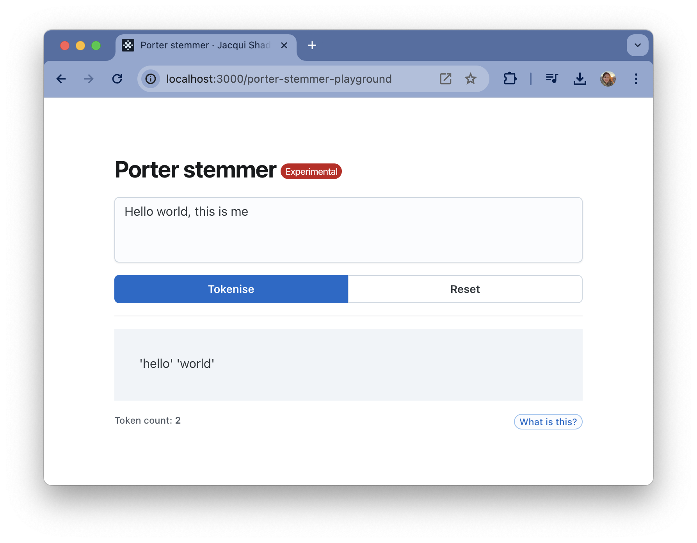

# porter-stemmer-playground

🌱 A sandbox for tokenising text using the [Porter stemming algorithm](http://snowball.tartarus.org/algorithms/porter/stemmer.html)



## Getting started

```bash
# Install dependencies
npm install

# Run the app
npm start
```
